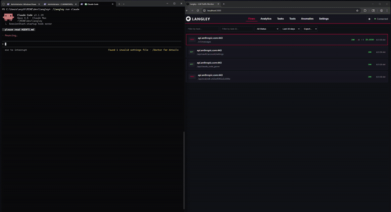

# Langley

A transparent proxy that records every LLM API call — full request/response bodies, token counts, costs, tool use, and anomalies — in a real-time dashboard. Supports Anthropic, OpenAI, AWS Bedrock, and Google Gemini.

## What It Does



Langley sits between your application and LLM provider APIs. Every request and response passes through, gets stored in SQLite, and appears in a real-time dashboard. Nothing reaches your agent that didn't come through the provider, and nothing leaves without being recorded.

```
Your App  --HTTPS-->  Langley Proxy  --HTTPS-->  LLM API
                          |
                       SQLite
                          |
                   WebSocket --> Dashboard
```

**Why this exists:** LLM agents make opaque, expensive API calls. Langley makes them visible — every message, tool call, token, and dollar. You see exactly what your agent sends, what it gets back, and where it wastes money.

## Quick Start

```bash
# 1. Build
go build -o langley ./cmd/langley

# 2. Trust the CA certificate (one-time)
langley setup

# 3. Start
./langley

# 4. Run your agent through the proxy
langley run claude
langley run python script.py
```

Open `http://localhost:9091` and enter the auth token shown at startup.

`langley run` sets `HTTPS_PROXY`, `HTTP_PROXY`, `NODE_EXTRA_CA_CERTS`, `SSL_CERT_FILE`, and `REQUESTS_CA_BUNDLE` automatically. Or set them yourself:

```bash
# Unix
export HTTPS_PROXY=http://localhost:9090

# PowerShell
$env:HTTPS_PROXY = "http://localhost:9090"
```

## Dashboard

Six views, all fed by real-time WebSocket updates:

| View | What you see |
|------|-------------|
| **Flows** | Every request/response with method, host, path, status, tokens, cost. Click any flow to inspect full request/response headers and bodies — including decompressed content, with a tabbed viewer. Filter by host, task, or status. Export to NDJSON, JSON, or CSV. |
| **Analytics** | Total cost, token counts, daily cost chart. The numbers that answer "how much did that session cost?" |
| **Tasks** | Flows grouped by task. See token usage and cost per logical unit of work, not just per request. |
| **Tools** | Tool invocation stats: call counts, success rates, average duration. Click any tool to drill into individual invocations — see the exact input JSON sent to each tool and the result returned, with duration and parent flow context. |
| **Anomalies** | Flagged events: large contexts (>100k tokens), slow responses (>30s), rapid retries, high-cost requests (>$1), tool failures. |
| **Settings** | Configure task idle gap. |

Keyboard navigation: `j`/`k` to move, `Enter` to select, `Esc` to close, `?` for help. Dark/light theme toggle in the header.

## How Task Grouping Works

Langley groups related requests into tasks using a layered strategy:

1. **Explicit header** -- `X-Langley-Task` on the request
2. **Request metadata** -- User ID from the request body
3. **Inferred** -- Same host, gap of less than 5 minutes between requests

Inferred tasks are marked `task_source: 'inferred'` so you can filter them in analytics.

## Anomaly Detection

Langley flags unusual patterns automatically:

| Anomaly | Default Threshold | What it catches |
|---------|------------------|-----------------|
| Large context | >100k input tokens | Runaway context windows |
| Slow response | >30s | Stuck or overloaded endpoints |
| Rapid repeats | >5 calls in 10s | Retry loops |
| High cost | >$1 per request | Expensive single calls |
| Tool failures | Any failure | Broken tool integrations |
| Dropped events | Any drop | Backpressure in the proxy pipeline |

All thresholds are configurable in `langley.yaml`.

## CLI Reference

```
langley [OPTIONS]
langley <command> [args]

COMMANDS:
  run <cmd> [args]    Run a command with proxy environment configured
  setup               Install CA certificate to system trust store
  token show          Show the current auth token
  token rotate        Generate a new auth token

OPTIONS:
  -config <path>      Path to configuration file
  -listen <addr>      Proxy listen address (default: localhost:9090)
  -api <addr>         API server address (default: localhost:9091)
  -version            Show version information
  -show-ca            Show CA certificate path and trust instructions
  -help               Show help
```

## Security

**Credential redaction** happens on write. Sensitive data never reaches disk:
- Authorization headers, API keys, cookies stripped before storage
- Body patterns (`sk-ant-*`, `sk-*`, `AKIA*`, `AIza*`) masked
- Base64 images replaced with `[IMAGE base64 redacted]`
- Configurable patterns for custom secrets

**TLS**: Upstream certificates validated by default. CA private key at 0600 permissions. Certificates use random serial numbers.

**Authentication**: Bearer token on all API endpoints. WebSocket validates localhost origin. Tokens auto-generated and stored in config.

**Network**: Proxy and API bind to localhost only. No remote access by default.

## Architecture

- **Go backend** -- MITM proxy, REST API, WebSocket server, analytics engine
- **SQLite** -- WAL mode, async batch writes, TTL-based retention, hourly cleanup
- **React frontend** -- Vite build, WebSocket for live updates, hash-based routing

Provider detection is pluggable. Each provider (Anthropic, OpenAI, Bedrock, Gemini) implements host detection and response parsing through a common interface.

See `docs/ARCHITECTURE.md` for internals: data flow, store interface, extension points.

## Development

```bash
make install-deps   # Go modules + npm install (first time)
make dev            # Backend + Vite dev server with hot reload
make test           # All tests with race detector
make check          # Lint + test (quality gate)
make build          # Production binary + frontend bundle
make stop           # Kill orphaned dev processes (Windows Ctrl+C workaround)
```

Dashboard at `http://localhost:3000` during development. Proxy at `localhost:9090`.

Frontend tests use Playwright. Backend tests use Go's race detector.
